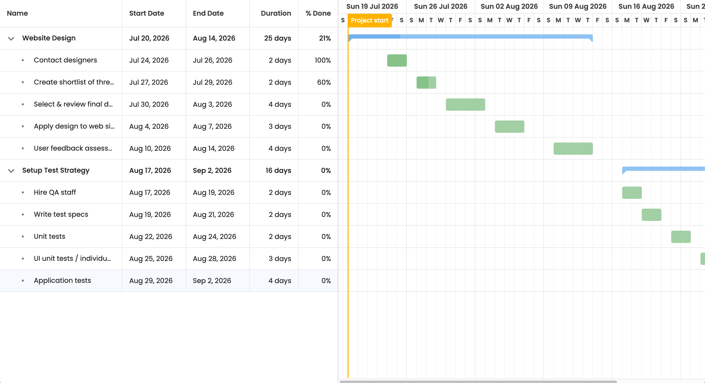

# How to use Bryntum Gantt with .NET and SQLite

[Bryntum Gantt](https://bryntum.com/products/gantt/) is a performant, highly customizable JavaScript UI component 
for project management and scheduling. It integrates with the major JavaScript web frameworks. This tutorial demonstrates how to use 
Bryntum Gantt with a [.NET Framework](https://dotnet.microsoft.com/en-us/) backend and SQLite.

This tutorial covers the following:

- Setting up a .NET Web API that uses a local SQLite database and [Entity Framework Core](https://learn.microsoft.com/en-us/ef/core/).
- Configuring Entity Framework Core models to define the database table structure.
- Running a seed command to populate the database with example JSON data.
- Creating API endpoints to load data and sync data changes to the database.
- Building a Bryntum Gantt frontend using TypeScript and Vite.
- Connecting the Bryntum Gantt to the database and synchronizing changes using 
  the created API endpoints.

Here's what we'll build:



## Prerequisites

To follow along, you need the [.NET SDK](https://dotnet.microsoft.com/en-us/download) (version 10.0 or later) and 
[Node.js](https://nodejs.org/en/download) installed on your system.

## Getting started

This tutorial uses a starter project for the .NET backend and the Vite TypeScript frontend.

### Backend starter

Clone the [.NET starter GitHub repository](https://github.com/ritza-co/bryntum-gantt-dotnet-starter). The code for 
the completed tutorial is in the 
[`completed-app`](https://github.com/ritza-co/bryntum-gantt-dotnet-starter/tree/completed-app) branch 
of the repository.

The .NET app has the following directory structure:

- `Program.cs` sets up and starts an ASP.NET Core Web API with a single "Hello World" endpoint.
- `dotnet-sqlite-gantt.csproj` is the project file that defines dependencies and project settings.
- `appsettings.json` is the application's configuration file.
- `example-data` contains the example tasks for a Bryntum Gantt, stored as JSON data. This data 
  populates a local SQLite database.

Follow the instructions in the `README.md` file to install the dependencies.

### Frontend starter

Clone the [Bryntum Gantt starter GitHub repository](https://github.com/ritza-co/bryntum-gantt-vanilla-typescript-starter). 
The code for the completed tutorial is in the [`completed-app`](https://github.com/ritza-co/bryntum-gantt-vanilla-typescript-starter/tree/completed-app) 
branch of the repository.

Follow the instructions in the `README.md` file to install the dependencies and run the app.

## Configure the .NET SQLite database connection

In the backend starter, update the `appsettings.json` file to add a connection string below the `"AllowedHosts"` key, 
for a local SQLite database:

```json
"ConnectionStrings": {
  "DefaultConnection": "Data Source=gantt.sqlite3"
}
```

This string names the database file `gantt.sqlite3` and stores it in the project directory.

## Create the data models

The database models for the tasks example data use [Entity Framework Core](https://learn.microsoft.com/en-us/ef/core/). 
In Bryntum Gantt, data is managed through a [project](https://bryntum.com/products/gantt/docs/api/Gantt/model/ProjectModel) 
that contains stores for tasks, dependencies, resources, assignments, and calendars.

This basic tutorial covers making models for the [TaskStore](https://bryntum.com/products/gantt/docs/api/Gantt/data/TaskStore).

### Create the Task model

In the project directory, create a folder called `Models`. In this folder, create a file called `Task.cs` and add the 
following lines of code to it:

```csharp
using System.ComponentModel.DataAnnotations;
using System.ComponentModel.DataAnnotations.Schema;
using System.Text.Json.Serialization;

namespace GanttApi.Models
{
  [Table("tasks")]
  public class GanttTask
  {
    [Key]
    [Column("id")]
    [JsonPropertyName("id")]
    public int Id { get; set; }

    [JsonPropertyName("$PhantomId")]
    [NotMapped]
    [JsonIgnore(Condition = JsonIgnoreCondition.WhenWritingNull)]
    public string? PhantomId { get; set; }

    [Column("name")]
    [JsonPropertyName("name")]
    public string? Name { get; set; }

    [Column("startDate")]
    [JsonPropertyName("startDate")]
    public DateTime? StartDate { get; set; }

    [Column("endDate")]
    [JsonPropertyName("endDate")]
    public DateTime? EndDate { get; set; }

    [Column("duration")]
    [JsonPropertyName("duration")]
    public double? Duration { get; set; }

    [Column("percentDone")]
    [JsonPropertyName("percentDone")]
    public double? PercentDone { get; set; } = 0;

    [Column("parentId")]
    [JsonPropertyName("parentId")]
    public int? ParentId { get; set; }

    [Column("expanded")]
    [JsonPropertyName("expanded")]
    public bool? Expanded { get; set; } = true;

    [Column("rollup")]
    [JsonPropertyName("rollup")]
    public bool? Rollup { get; set; } = false;

    [Column("manuallyScheduled")]
    [JsonPropertyName("manuallyScheduled")]
    public bool? ManuallyScheduled { get; set; } = true;

    [Column("parentIndex")]
    [JsonPropertyName("parentIndex")]
    public int? ParentIndex { get; set; }

    [Column("effort")]
    [JsonPropertyName("effort")]
    public int? Effort { get; set; }        
    }
}
```

We define the `GanttTask` model class that represents the `"tasks"` table in the database. The table name is set using the 
`[Table("tasks")]` attribute.

The model properties define the columns for the database table. We use [data annotations](https://learn.microsoft.com/en-us/ef/core/modeling/entity-properties) 
to set the column names, data types, and constraints. The `[JsonPropertyName]` attributes ensure the properties are 
serialized to the correct JSON property names expected by the Bryntum Gantt.

The `ParentId` property establishes the parent-child relationship between tasks, allowing for hierarchical task structures.

### Create the sync request and response models

The Bryntum Gantt project loads data from and syncs data changes to the .NET backend using 
a specific [sync request structure](https://bryntum.com/products/gantt/docs/guide/Gantt/data/crud_manager#sync-request-structure).

Create a file called `SyncModels.cs` in the `Models` directory and add the following code to it:

```csharp
using System.Text.Json;
using System.Text.Json.Serialization;

namespace GanttApi.Models
{
    /// <summary>
    /// Represents an optional JSON property where we need to distinguish:
    /// - property missing (IsSet = false)
    /// - property present with value (IsSet = true, Value = ...)
    /// - property present with explicit null (IsSet = true, Value = null)
    /// </summary>
    [JsonConverter(typeof(OptionalJsonConverterFactory))]
    public readonly struct Optional<T>
    {
        public Optional(T? value, bool isSet)
        {
            Value = value;
            IsSet = isSet;
        }

        public bool IsSet { get; }
        public T? Value { get; }
    }

    public sealed class OptionalJsonConverterFactory : JsonConverterFactory
    {
        public override bool CanConvert(Type typeToConvert)
            => typeToConvert.IsGenericType && typeToConvert.GetGenericTypeDefinition() == typeof(Optional<>);

        public override JsonConverter CreateConverter(Type typeToConvert, JsonSerializerOptions options)
        {
            var innerType = typeToConvert.GetGenericArguments()[0];
            var converterType = typeof(OptionalJsonConverter<>).MakeGenericType(innerType);
            return (JsonConverter)Activator.CreateInstance(converterType)!;
        }

        private sealed class OptionalJsonConverter<T> : JsonConverter<Optional<T>>
        {
            public override Optional<T> Read(ref Utf8JsonReader reader, Type typeToConvert, JsonSerializerOptions options)
            {
                if (reader.TokenType == JsonTokenType.Null)
                {
                    return new Optional<T>(default, isSet: true);
                }

                var value = JsonSerializer.Deserialize<T>(ref reader, options);
                return new Optional<T>(value, isSet: true);
            }

            public override void Write(Utf8JsonWriter writer, Optional<T> value, JsonSerializerOptions options)
            {
                // Not currently used for responses, but implemented for completeness.
                JsonSerializer.Serialize(writer, value.Value, options);
            }
        }
    }

    /// <summary>
    /// Patch DTO for task updates (supports partial updates while preserving "explicit null" intent).
    /// </summary>
    public class GanttTaskPatch
    {
        [JsonPropertyName("id")]
        public int Id { get; set; }

        [JsonPropertyName("name")]
        public Optional<string?> Name { get; set; }

        [JsonPropertyName("startDate")]
        public Optional<DateTime?> StartDate { get; set; }

        [JsonPropertyName("endDate")]
        public Optional<DateTime?> EndDate { get; set; }

        [JsonPropertyName("duration")]
        public Optional<double?> Duration { get; set; }

        [JsonPropertyName("percentDone")]
        public Optional<double?> PercentDone { get; set; }

        [JsonPropertyName("parentId")]
        public Optional<int?> ParentId { get; set; }

        [JsonPropertyName("parentIndex")]
        public Optional<int?> ParentIndex { get; set; }

        [JsonPropertyName("expanded")]
        public Optional<bool?> Expanded { get; set; }

        [JsonPropertyName("rollup")]
        public Optional<bool?> Rollup { get; set; }

        [JsonPropertyName("manuallyScheduled")]
        public Optional<bool?> ManuallyScheduled { get; set; }

        [JsonPropertyName("effort")]
        public Optional<int?> Effort { get; set; }
    }

    public class TaskStoreChanges
    {
        [JsonPropertyName("added")]
        public List<GanttTask>? Added { get; set; }

        [JsonPropertyName("updated")]
        public List<GanttTaskPatch>? Updated { get; set; }

        [JsonPropertyName("removed")]
        public List<GanttTask>? Removed { get; set; }
    }

    // Request DTOs
    public class SyncRequest
    {
        [JsonPropertyName("requestId")]
        public long? RequestId { get; set; }

        [JsonPropertyName("revision")]
        public int? Revision { get; set; }

        [JsonPropertyName("tasks")]
        public TaskStoreChanges? Tasks { get; set; }
    }

    public class StoreChanges<T>
    {
        [JsonPropertyName("added")]
        public List<T>? Added { get; set; }

        [JsonPropertyName("updated")]
        public List<T>? Updated { get; set; }

        [JsonPropertyName("removed")]
        public List<T>? Removed { get; set; }
    }

    // Response DTOs
    public class LoadResponse
    {
        [JsonPropertyName("success")]
        public bool Success { get; set; } = true;

        [JsonPropertyName("requestId")]
        public object? RequestId { get; set; }

        [JsonPropertyName("revision")]
        public int Revision { get; set; } = 1;

        [JsonPropertyName("tasks")]
        public StoreData<GanttTask>? Tasks { get; set; }
    }

    public class StoreData<T>
    {
        [JsonPropertyName("rows")]
        public List<T> Rows { get; set; } = new List<T>();

        [JsonPropertyName("total")]
        public int Total { get; set; }
    }

    public class SyncResponse
    {
        [JsonPropertyName("success")]
        public bool Success { get; set; }

        [JsonPropertyName("requestId")]
        public long? RequestId { get; set; }

        [JsonPropertyName("revision")]
        public int? Revision { get; set; }

        [JsonPropertyName("message")]
        public string? Message { get; set; }

        [JsonPropertyName("tasks")]
        public SyncStoreResponse? Tasks { get; set; }
    }

    public class SyncStoreResponse
    {
        [JsonPropertyName("rows")]
        public List<GanttTask>? Rows { get; set; }
    }
}
```

The `SyncRequest` class contains the `requestId`, `revision`, and optional `tasks` property that holds the changes 
for the task store. The `TaskStoreChanges` class contains lists for added, updated, and removed records, with 
`GanttTaskPatch` used for updates to support partial updates.

The `Optional<T>` struct and `OptionalJsonConverterFactory` allow us to distinguish between a property being missing 
from JSON (no update needed) versus explicitly set to null (should clear the value).

<div class="note">
The <code>$PhantomId</code> is a phantom identifier, a unique, auto-generated client-side value used to identify 
the record. You should not persist phantom identifiers in your database.
</div>

## Create the database context

Create a folder called `Data` in the project directory. In this folder, create a `GanttContext.cs` file 
containing the following lines of code:

```csharp
using Microsoft.EntityFrameworkCore;
using GanttApi.Models;

namespace GanttApi.Data
{
    public class GanttContext : DbContext
    {
        public GanttContext(DbContextOptions<GanttContext> options) : base(options) { }

        public DbSet<GanttTask> Tasks { get; set; } = null!;

        protected override void OnModelCreating(ModelBuilder modelBuilder)
        {
            base.OnModelCreating(modelBuilder);

            modelBuilder.Entity<GanttTask>(entity =>
            {
                entity.ToTable("tasks");
                entity.HasKey(t => t.Id);
                entity.Property(t => t.Id).ValueGeneratedOnAdd();
                
                // Self-referencing relationship for parent-child tasks
                // OnDelete Cascade ensures children are deleted when parent is deleted
                entity.HasMany<GanttTask>()
                    .WithOne()
                    .HasForeignKey(t => t.ParentId)
                    .IsRequired(false)
                    .OnDelete(DeleteBehavior.Cascade);
            });
        }
    }
}
```

The `GanttContext` class inherits from `DbContext` and defines a `DbSet` property for tasks. 
The `OnModelCreating` method configures the table name, primary key, and establishes the self-referencing 
relationship for parent-child tasks with cascade delete behavior.

## Configure the .NET backend to use SQLite and seed the local SQLite database with example data

First, install the `Microsoft.EntityFrameworkCore.Sqlite` package:

```bash
dotnet add package Microsoft.EntityFrameworkCore.Sqlite
```

Now let's update the `Program.cs` file to configure the .NET backend to use SQLite and create a seeding function that 
populates a local SQLite database with the example JSON data from the `example-data` directory.

Replace the contents of `Program.cs` with the following:

```csharp
using System.Text.Json;
using System.Text.Json.Serialization;
using Microsoft.EntityFrameworkCore;
using GanttApi.Data;
using GanttApi.Models;

var builder = WebApplication.CreateBuilder(args);

// Add services to the container
builder.Services.AddControllers()
    .AddJsonOptions(options =>
    {
        options.JsonSerializerOptions.PropertyNameCaseInsensitive = true;
        options.JsonSerializerOptions.NumberHandling = JsonNumberHandling.AllowReadingFromString;
        options.JsonSerializerOptions.DefaultIgnoreCondition = JsonIgnoreCondition.WhenWritingNull;
    });
builder.Services.AddEndpointsApiExplorer();

// Configure EF Core to use SQLite
var connectionString = builder.Configuration.GetConnectionString("DefaultConnection");
builder.Services.AddDbContext<GanttContext>(options =>
    options.UseSqlite(connectionString)
);

// Add CORS service - Make sure this is before app.Build()
builder.Services.AddCors(options =>
{
    options.AddPolicy("AllowFrontend", policy =>
    {
        policy.WithOrigins("http://localhost:5173")
              .AllowAnyHeader()
              .AllowAnyMethod();
    });
});

var app = builder.Build();

// Check if we're running in seed mode
if (args.Contains("--seed"))
{
    await SeedDatabase(app);
    return;
}

// Enable CORS - This MUST be early in the middleware pipeline
app.UseCors("AllowFrontend");

// Ensure database is created
using (var scope = app.Services.CreateScope())
{
    var context = scope.ServiceProvider.GetRequiredService<GanttContext>();
    context.Database.EnsureCreated();
}

app.UseAuthorization();
app.MapControllers();

app.Run();

// Seeding function
static async Task SeedDatabase(WebApplication app)
{
    using var scope = app.Services.CreateScope();
    var context = scope.ServiceProvider.GetRequiredService<GanttContext>();

    // Drop existing tables and recreate
    await context.Database.EnsureDeletedAsync();
    await context.Database.EnsureCreatedAsync();
    Console.WriteLine("Database recreated.");

    // Read JSON data from example files
    var basePath = Path.GetFullPath(Path.Combine(AppContext.BaseDirectory, "..", "..", "..", "example-data"));
    
    var tasksJsonPath = Path.Combine(basePath, "tasks.json");

    Console.WriteLine($"Reading tasks from: {tasksJsonPath}");

    var tasksJson = await File.ReadAllTextAsync(tasksJsonPath);

    var options = new JsonSerializerOptions
    {
        PropertyNameCaseInsensitive = true
    };

    var tasks = JsonSerializer.Deserialize<List<GanttTask>>(tasksJson, options);

    if (tasks != null && tasks.Count > 0)
    {
        await context.Tasks.AddRangeAsync(tasks);
        await context.SaveChangesAsync();
        Console.WriteLine($"Added {tasks.Count} tasks.");
    }

    Console.WriteLine("Database seeded successfully!");
}
```

This updated `Program.cs` file configures the Entity Framework Core to use SQLite with the connection string 
from `appsettings.json`. It also maps controllers for the API endpoints (which we'll create) and adds CORS configuration 
to allow requests from the frontend running on `http://localhost:5173`.

We can run the `SeedDatabase` function with the `--seed` command line argument to populate the database 
with the example data.

Run the seeding command to create and populate the database:

```shell
dotnet run -- --seed
```

You should see the following output in your terminal:

```
Database recreated.
Reading tasks from: /path/to/example-data/tasks.json
Added 12 tasks.
Database seeded successfully!
```

You will also see a `gantt.sqlite3` file created in your project folder. This database is populated with the example 
tasks data.

## Create an API endpoint to load the Bryntum Gantt data from the database

Create a folder called `Controllers` in the project directory. Create a file called `GanttController.cs` 
in this folder. First, add the controller class with the `/api/load` endpoint:

```csharp
using Microsoft.AspNetCore.Mvc;
using Microsoft.EntityFrameworkCore;
using GanttApi.Data;
using GanttApi.Models;

namespace GanttApi.Controllers
{
    [ApiController]
    [Route("api")]
    public class GanttController : ControllerBase
    {
        private readonly GanttContext _context;
        private readonly ILogger<GanttController> _logger;

        public GanttController(GanttContext context, ILogger<GanttController> logger)
        {
            _context = context;
            _logger = logger;
        }

        [HttpGet("load")]
        public async Task<ActionResult<LoadResponse>> Load()
        {
            try
            {
                // ParentIndex is a sibling-ordering field (it only makes sense within the same parent),
                // so we order by ParentId first and then ParentIndex.
                var tasks = await _context.Tasks
                    .OrderBy(t => t.ParentId)
                    .ThenBy(t => t.ParentIndex)
                    .ToListAsync();

                var response = new LoadResponse
                {
                    Success = true,
                    RequestId = Request.Headers["x-request-id"].FirstOrDefault() ?? DateTimeOffset.UtcNow.ToUnixTimeMilliseconds().ToString(),
                    Revision = 1,
                    Tasks = new StoreData<GanttTask> 
                    { 
                        Rows = tasks,
                        Total = tasks.Count
                    }
                };

                _logger.LogInformation("Loaded {TaskCount} tasks", tasks.Count);

                return Ok(response);
            }
            catch (Exception ex)
            {
                _logger.LogError(ex, "Error loading data");
                return StatusCode(500, new { success = false, message = "There was an error loading the tasks data." });
            }
        }
    }
}
```

The `/api/load` endpoint fetches all tasks from the SQLite database and returns them in the 
[load response structure](https://bryntum.com/products/gantt/docs/guide/Gantt/data/crud_manager#load-response-structure) 
that the Bryntum Gantt project expects. The tasks are ordered by `ParentId` and `ParentIndex` to maintain 
the correct hierarchical structure.

## Create an API endpoint to sync Bryntum Gantt data changes to the database

Below the `Load` method in `GanttController.cs`, add the following `Sync` method for syncing data changes:

```csharp
[HttpPost("sync")]
public async Task<ActionResult<SyncResponse>> Sync([FromBody] SyncRequest request)
{
    _logger.LogInformation("Sync request received. RequestId: {RequestId}", request.RequestId);
    
    try
    {
        var response = new SyncResponse
        {
            RequestId = request.RequestId,
            Revision = (request.Revision ?? 0) + 1,
            Success = true,
            Tasks = new SyncStoreResponse { Rows = new List<GanttTask>() }
        };

        if (request.Tasks != null)
        {
            await ApplyTaskChanges(request.Tasks, response);
        }

        return Ok(response);
    }
    catch (Exception ex)
    {
        _logger.LogError(ex, "Error syncing data");
        return StatusCode(500, new SyncResponse
        {
            RequestId = request.RequestId,
            Success = false,
            Message = "There was an error syncing the data changes."
        });
    }
}
```

The Bryntum Gantt sends JSON data in POST requests to the `/api/sync` endpoint when there are data changes. 
The request body is parsed to determine which data stores have changed. Let's create the `ApplyTaskChanges` 
helper method next.

### Create the ApplyTaskChanges helper method

In `GanttController.cs`, add the following `ApplyTaskChanges` method below the `Sync` method to 
handle task CRUD operations:

```csharp
private async Task ApplyTaskChanges(TaskStoreChanges changes, SyncResponse response)
{
    // Handle added tasks - map phantom IDs to real IDs
    if (changes.Added != null && changes.Added.Count > 0)
    {
        foreach (var newTask in changes.Added)
        {
            var phantomId = newTask.PhantomId;
            
            // Reset Id to 0 for new tasks (will be auto-generated)
            newTask.Id = 0;
            // Ensure Name is not null (required field)
            if (newTask.Name == null) newTask.Name = "";

            _context.Tasks.Add(newTask);
            await _context.SaveChangesAsync();

            // Return the created task (includes both $PhantomId and the real id for client mapping)
            newTask.PhantomId = phantomId;
            response.Tasks!.Rows!.Add(newTask);
        }
    }

    // Handle updated tasks
    if (changes.Updated != null && changes.Updated.Count > 0)
    {
        foreach (var taskUpdate in changes.Updated)
        {
            if (taskUpdate.Id > 0)
            {
                var existingTask = await _context.Tasks.FindAsync(taskUpdate.Id);
                if (existingTask != null)
                {
                    // Patch semantics:
                    // - If a property is missing in JSON, we ignore it (don't overwrite).
                    // - If a property is present with explicit null, we DO overwrite with null.
                    if (taskUpdate.Name.IsSet) existingTask.Name = taskUpdate.Name.Value;
                    if (taskUpdate.StartDate.IsSet) existingTask.StartDate = taskUpdate.StartDate.Value;
                    if (taskUpdate.EndDate.IsSet) existingTask.EndDate = taskUpdate.EndDate.Value;
                    if (taskUpdate.Duration.IsSet) existingTask.Duration = taskUpdate.Duration.Value;
                    if (taskUpdate.PercentDone.IsSet) existingTask.PercentDone = taskUpdate.PercentDone.Value;
                    if (taskUpdate.ParentId.IsSet) existingTask.ParentId = taskUpdate.ParentId.Value;
                    if (taskUpdate.ParentIndex.IsSet) existingTask.ParentIndex = taskUpdate.ParentIndex.Value;
                    if (taskUpdate.Expanded.IsSet) existingTask.Expanded = taskUpdate.Expanded.Value;
                    if (taskUpdate.Rollup.IsSet) existingTask.Rollup = taskUpdate.Rollup.Value;
                    if (taskUpdate.ManuallyScheduled.IsSet) existingTask.ManuallyScheduled = taskUpdate.ManuallyScheduled.Value;
                    if (taskUpdate.Effort.IsSet) existingTask.Effort = taskUpdate.Effort.Value;

                    await _context.SaveChangesAsync();
                }
            }
        }
    }

    // Handle removed tasks
    if (changes.Removed != null && changes.Removed.Count > 0)
    {
        foreach (var taskToRemove in changes.Removed)
        {
            if (taskToRemove.Id > 0)
            {
                var existingTask = await _context.Tasks.FindAsync(taskToRemove.Id);
                if (existingTask != null)
                {
                    _context.Tasks.Remove(existingTask);
                    await _context.SaveChangesAsync();
                }
            }
        }
    }
}
```

This helper method checks whether the change is an `added`, `updated`, or `removed` operation, and then performs 
the appropriate database operation. For added records, we return the phantom ID and the created database ID so the 
client can map them correctly.

Now that the API endpoints have been added, let's test the `/api/load` endpoint.

Run the development server if it's not already running:

```shell
dotnet run
```

Open [http://localhost:1337/api/load](http://localhost:1337/api/load) in your browser. You should see a JSON object of 
the tasks data from the SQLite database:

```json
{
  "success": true,
  "requestId": "1234567890",
  "revision": 1,
  "tasks": {
    "rows": [
      {
        "id": 1,
        "name": "Website Design",
        ...
```

Now that we've added the API endpoints, let's set up our frontend Bryntum Gantt. 

## Set up the frontend

Next, configure and add a Bryntum Gantt to the frontend starter project.

### Install the Bryntum Gantt component

First, access the Bryntum private npm registry by following the [guide in our docs](https://bryntum.com/products/gantt/docs/guide/Gantt/quick-start/javascript-npm#access-to-npm-registry). 

Once you've logged in to the registry, install the Bryntum Gantt component:

> TODO: ADD TAB like https://bryntum.com/products/gantt/docs/guide/Gantt/quick-start/javascript-npm#install-component

```shell
npm install @bryntum/gantt
```

```shell
npm install @bryntum/gantt@npm:@bryntum/gantt-trial
```

### Create the Gantt configuration

Create a file called `ganttConfig.ts` in the `src` folder and add the following lines of code to it:

```typescript
import { TaskModel, type GanttConfig  } from '@bryntum/gantt';

export const ganttConfig: GanttConfig = {
    appendTo   : 'app',
    viewPreset : 'weekAndDayLetter',
    barMargin  : 10,
    project    : {
        taskStore : {
            transformFlatData : true,

            // Ensure newly created tasks are manually scheduled. The project-level
            // "startedTaskScheduling : 'Manual'" does not automatically set the
            // TaskModel field `manuallyScheduled` on new records.
            listeners : {
                add({ records }) {
                    records?.forEach(task => {
                        (task as TaskModel).manuallyScheduled = true;
                    });
                }
            }
        },
        loadUrl               : 'http://localhost:1337/api/load',
        autoLoad              : true,
        syncUrl               : 'http://localhost:1337/api/sync',
        autoSync              : true,
        validateResponse      : true,
        startedTaskScheduling : 'Manual'
    },
    columns : [
        { type : 'name', field : 'name', text : 'Name', width : 250 },
        { type : 'startdate', field : 'startDate', text : 'Start Date' },
        { type : 'enddate', field : 'endDate', text : 'End Date' },
        { type : 'duration', field : 'fullDuration', text : 'Duration' },
        { type : 'percentdone', field : 'percentDone', text : '% Done', width : 80 }
    ]
};
```

We create a configuration object for the Bryntum Gantt and configure it to attach to the `<div>` element with an 
`id` of `"app"`. 

The `viewPreset` property sets the time axis granularity to show weeks and day letters. The `barMargin` sets 
spacing between task bars.

The `project` configuration includes:
- `taskStore.transformFlatData`: Enables automatic conversion of flat task data into a hierarchical tree structure 
  using `parentId`.
- `loadUrl` and `syncUrl`: The .NET API routes we created.
- `autoLoad` and `autoSync`: Enable automatic data loading and synchronization.
- `startedTaskScheduling: 'Manual'`: Ensures tasks are manually scheduled by default.

The `columns` array defines what columns to display in the Gantt's grid section.

### Create the Bryntum Gantt

Update the `main.ts` file to import and create the Bryntum Gantt:

```typescript
import { Gantt } from '@bryntum/gantt';
import { ganttConfig } from './ganttConfig';
import './style.css';

const gantt = new Gantt(ganttConfig);

console.log({ gantt });
```

We import the `Gantt` class from the Bryntum Gantt package and create an instance with our configuration.

### Add styles

Update the `style.css` file in the `src` directory to import the Bryntum Gantt styles and configure the layout:

```css
@import "https://fonts.googleapis.com/css2?family=Poppins:wght@300;400;500;600;700&display=swap";
@import "@bryntum/gantt/fontawesome/css/fontawesome.css";
@import "@bryntum/gantt/fontawesome/css/solid.css";
/* Import Gantt's structural CSS */
@import "@bryntum/gantt/gantt.css";
/* Import your preferred Bryntum theme */
@import "@bryntum/gantt/svalbard-light.css";

* {
    margin: 0;
}

body,
html {
    font-family: Poppins, "Open Sans", Helvetica, Arial, sans-serif;
}

#app {
    display: flex;
    flex-direction: column;
    height: 100vh;
    font-size: 14px;
}
```

We import the CSS for the Svalbard light theme (one of the four available themes with light and dark variants).

You can also create custom themes. The structural CSS and themes have separate imports. You can read more about styling 
the Gantt in our [docs](https://bryntum.com/products/gantt/docs/guide/Gantt/customization/styling).

## Run the application

To view the completed application, first make sure the backend is running:

```shell
dotnet run
```

Then, in a separate terminal, start the frontend:

```shell
npm run dev
```

Open [http://localhost:5173](http://localhost:5173/) in your browser to see the Bryntum Gantt with 
the example data from the local SQLite database:


Because the Bryntum Gantt has CRUD functionality, any changes made to it are saved to the SQLite database.

## Next steps

This tutorial covers the basics of using Bryntum Gantt with .NET and SQLite. Take a look at the 
[Bryntum Gantt examples page](https://bryntum.com/products/gantt/examples/) to browse the additional features 
you can add to your Gantt, such as:

- [Task dependencies](https://bryntum.com/products/gantt/examples/dependencies/)
- [Critical path highlighting](https://bryntum.com/products/gantt/examples/criticalpaths/)
- [Resource assignment](https://bryntum.com/products/gantt/examples/resourceassignment/)
